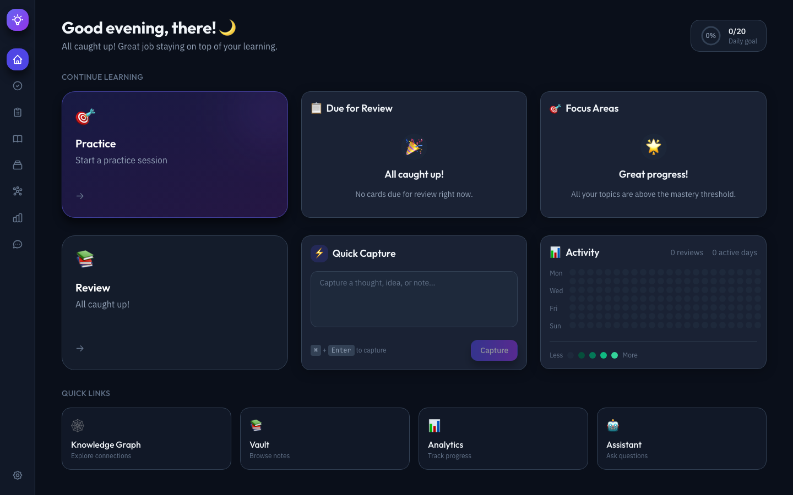
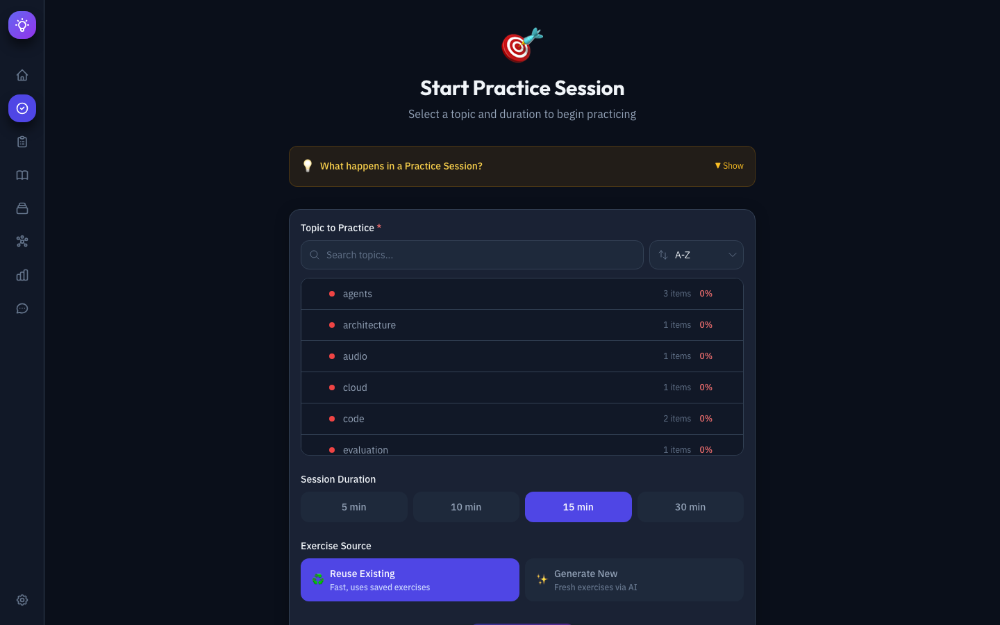
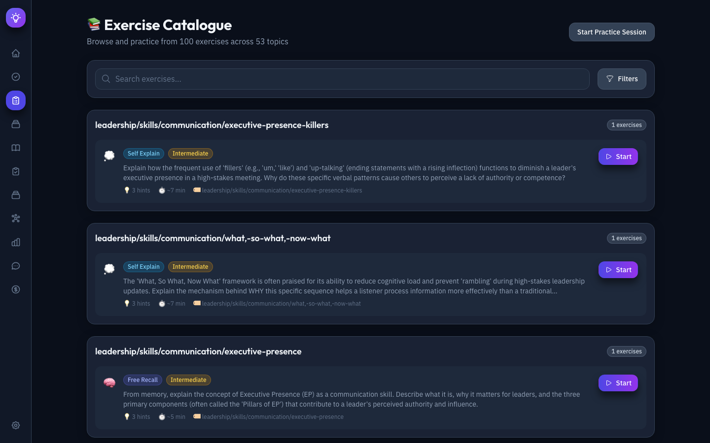
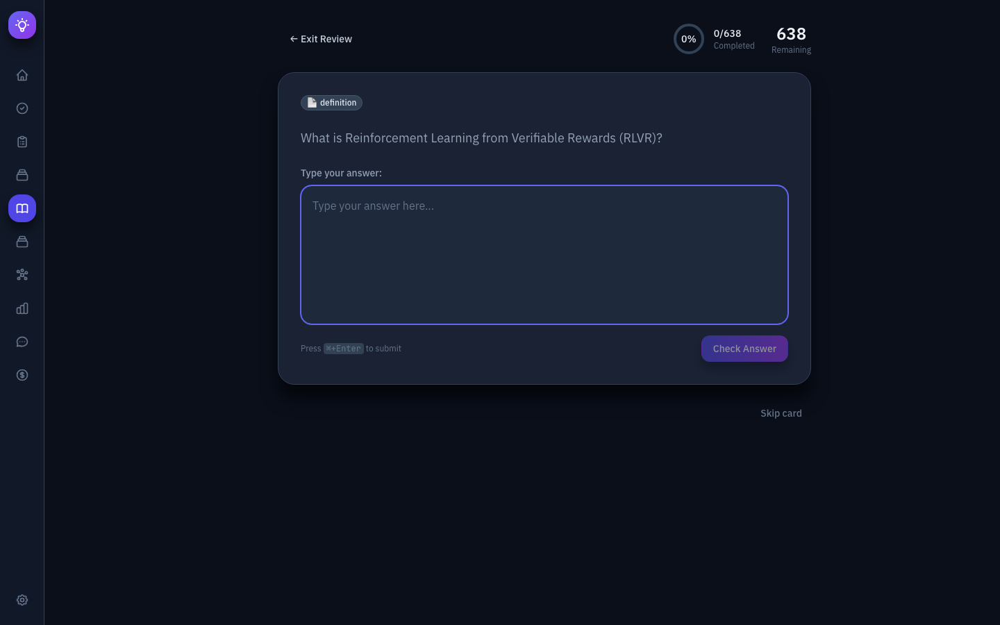
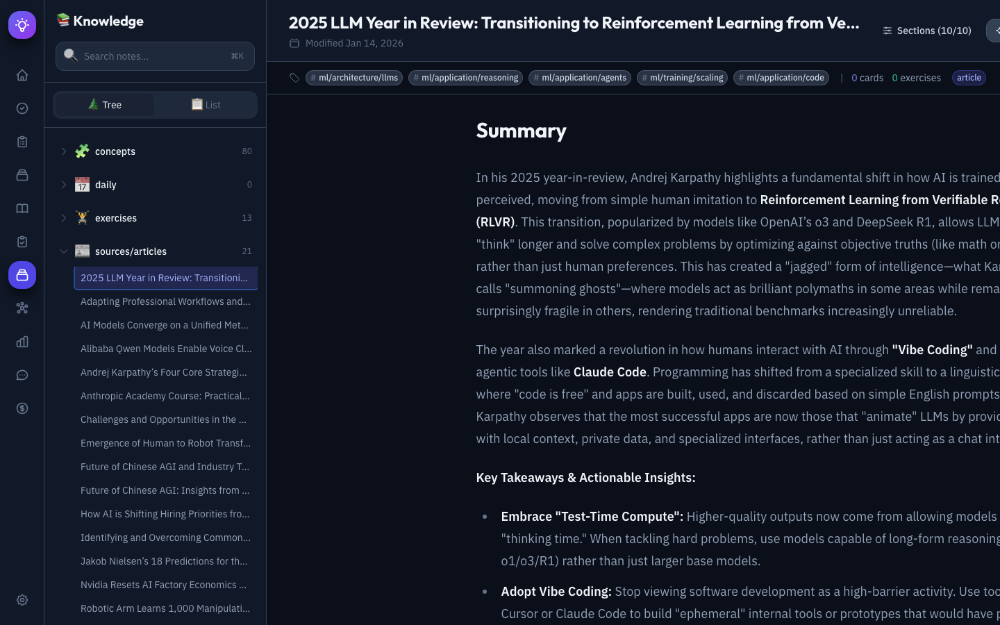
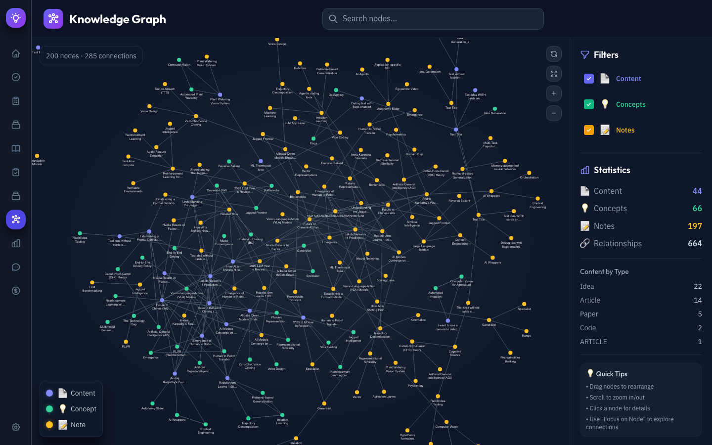
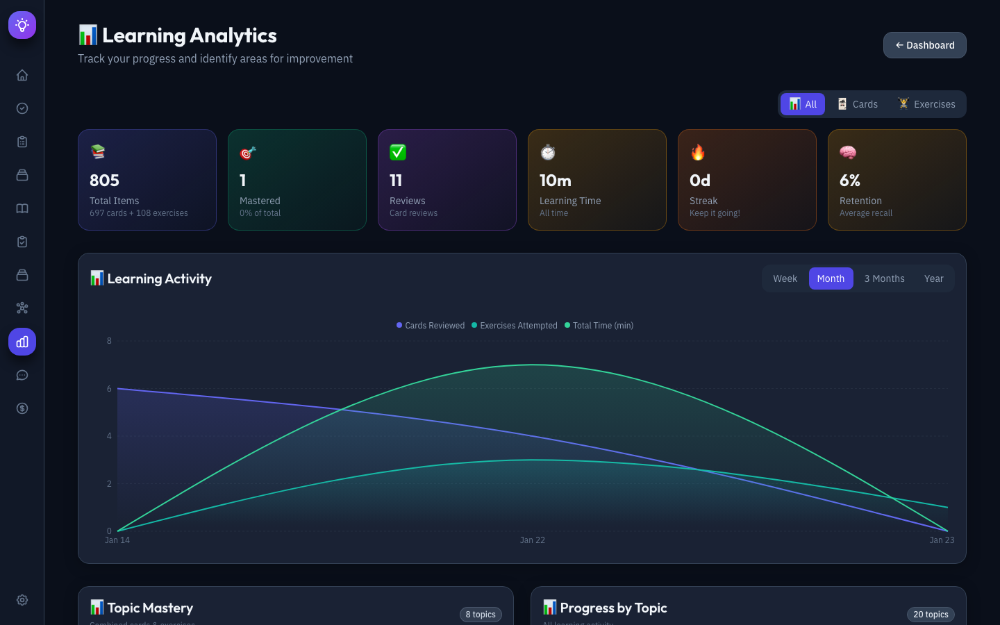
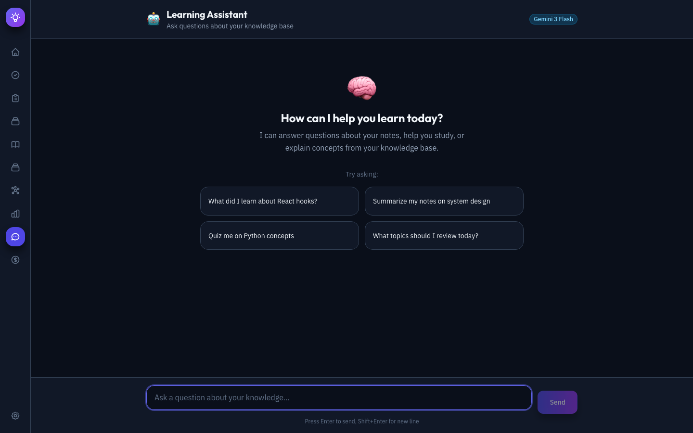
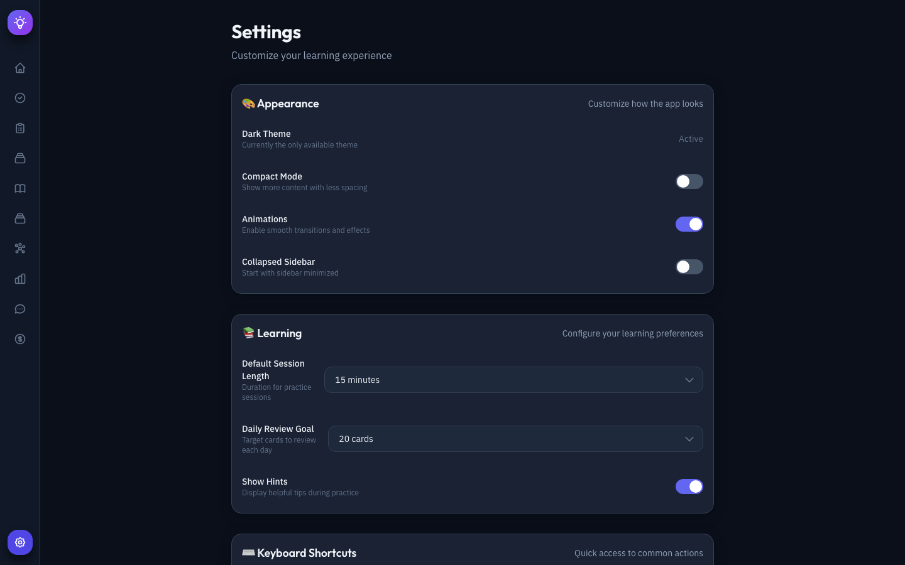

# Second Brain: Personal Knowledge Management & Learning System

> *"Tell me and I forget, teach me and I may remember, involve me and I learn."*
> Benjamin Franklin

A comprehensive system for ingesting, organizing, connecting, and actively learning from personal and professional knowledge sources—powered by LLMs and graph-based knowledge representation.

---

## 📑 Table of Contents

- [Vision](#-vision)
- [Core Philosophy](#-core-philosophy)
  - [The Two-Fold Challenge](#the-two-fold-challenge)
  - [Key Insight](#key-insight)
- [System Architecture](#-system-architecture)
- [Ingestion Pipelines](#-ingestion-pipelines)
  - [Academic Papers (PDF)](#1-academic-papers-pdf)
  - [Web Content](#2-web-content-articles-blog-posts)
  - [Physical Books](#3-physical-books)
  - [Code & Repositories](#4-code--repositories)
  - [Ideas & Fleeting Notes](#5-ideas--fleeting-notes)
- [Organization Strategy](#️-organization-strategy)
- [Learning & Deliberate Practice](#-learning--deliberate-practice-system)
  - [Learning Science Foundation](#learning-science-foundation)
  - [Core Principles](#core-principles)
  - [Exercise Types](#exercise-types)
  - [Spaced Repetition Integration](#spaced-repetition-integration)
- [Technical Stack](#️-technical-stack)
- [Web Application](#️-web-application)
  - [Architecture](#architecture)
  - [Screenshots](#screenshots)
- [Getting Started](#-getting-started)
  - [Prerequisites](#prerequisites)
  - [Quick Start](#quick-start)
  - [Setup Options](#setup-options)
  - [Access Points](#access-points)
- [Implementation Status](#-implementation-status)
- [Documentation](#-documentation)
  - [Design Documents](#design-documents)
  - [Implementation Plans](#implementation-plans)
- [Open Research Questions](#-open-research-questions)
- [Future Extensions](#-future-extensions)
  - [Tool Calling for Learning Assistant](#tool-calling-for-learning-assistant)
  - [MCP Integration](#mcp-integration-model-context-protocol)
  - [Mobile Capture (PWA)](#-mobile-capture-pwa)
- [Production Deployment](#-production-deployment)
- [Contributing](#-contributing)
- [Security](#-security)
- [License](#-license)
- [References](#-references)

---

## 🎯 Vision

Transform passive information consumption into **active knowledge acquisition** through:
1. **Automated ingestion** of diverse data sources
2. **Intelligent summarization** and connection discovery
3. **Deliberate practice** via AI-generated exercises and spaced repetition

---

## 🧠 Core Philosophy

### The Two-Fold Challenge

| Challenge | Focus | Solution Approach |
|-----------|-------|-------------------|
| **Extraction & Summarization** | LLM-powered | Automated pipelines that distill raw sources into structured, interconnected notes |
| **Learning & Retention** | Human-centered | Active exercises, spaced repetition, and deliberate practice systems |

### Key Insight
These challenges can be addressed independently, but solving extraction *in service of* learning maximizes value. Every piece of ingested content should feed into the learning loop.

---

## 📊 System Architecture

```
┌─────────────────────────────────────────────────────────────────────────────┐
│                              DATA SOURCES                                    │
├─────────────┬─────────────┬─────────────┬─────────────┬─────────────────────┤
│   Papers    │  Articles   │   Books     │    Code     │   Ideas & Notes     │
│  (Books.app)│ (Raindrop)  │ (Physical)  │ (Git repos) │   (Manual input)    │
└──────┬──────┴──────┬──────┴──────┬──────┴──────┬──────┴──────────┬──────────┘
       │             │             │             │                 │
       ▼             ▼             ▼             ▼                 ▼
┌─────────────────────────────────────────────────────────────────────────────┐
│                         INGESTION LAYER                                      │
├─────────────────────────────────────────────────────────────────────────────┤
│  • PDF Parser + Highlight Extractor + Handwriting OCR (Vision LLM)           │
│  • Raindrop API Client                                                       │
│  • Book Photo OCR Pipeline (Mistral Vision API)                              │
│  • Git/GitHub API Integration                                                │
│  • Manual/CLI Entry Tools                                                    │
└─────────────────────────────────────────────────────────────────────────────┘
                                    │
                                    ▼
┌─────────────────────────────────────────────────────────────────────────────┐
│                       PROCESSING LAYER (LLM-Powered)                         │
├─────────────────────────────────────────────────────────────────────────────┤
│  • Summarization Engine                                                      │
│  • Key Concept Extraction                                                    │
│  • Tag & Topic Classification                                                │
│  • Connection Discovery (semantic similarity)                                │
│  • Follow-up Task Generation                                                 │
│  • Exercise & Quiz Generation                                                │
└─────────────────────────────────────────────────────────────────────────────┘
                                    │
                                    ▼
┌─────────────────────────────────────────────────────────────────────────────┐
│                         KNOWLEDGE HUB (Obsidian)                             │
├─────────────────────────────────────────────────────────────────────────────┤
│  📁 vault/                                                                   │
│  ├── 📁 sources/           # Raw ingested content organized by type          │
│  │   ├── 📁 papers/                                                          │
│  │   ├── 📁 articles/                                                        │
│  │   ├── 📁 books/                                                           │
│  │   ├── 📁 code/                                                            │
│  │   └── 📁 ideas/                                                           │
│  ├── 📁 topics/            # Topic-based index notes (auto-generated)        │
│  ├── 📁 projects/          # Active learning projects                        │
│  ├── 📁 exercises/         # Generated practice problems                     │
│  ├── 📁 reviews/           # Spaced repetition queue                         │
│  └── 📁 meta/              # System config, templates, scripts               │
└─────────────────────────────────────────────────────────────────────────────┘
                                    │
                                    ▼
┌─────────────────────────────────────────────────────────────────────────────┐
│                         KNOWLEDGE GRAPH (Neo4j)                              │
├─────────────────────────────────────────────────────────────────────────────┤
│  Nodes: Concepts, Sources, Topics, Authors, Tags                             │
│  Edges: RELATES_TO, CITES, CONTRADICTS, EXTENDS, PREREQUISITE_FOR           │
│  Queries: "What do I know about X?", "What connects A to B?"                 │
└─────────────────────────────────────────────────────────────────────────────┘
                                    │
                                    ▼
┌─────────────────────────────────────────────────────────────────────────────┐
│                       LEARNING ASSISTANT (LLM Agent)                         │
├─────────────────────────────────────────────────────────────────────────────┤
│  • Conversational knowledge retrieval                                        │
│  • Guided learning sessions                                                  │
│  • Adaptive exercise generation                                              │
│  • Progress tracking & weak-spot identification                              │
│  • Connection suggestions ("Have you considered how X relates to Y?")        │
└─────────────────────────────────────────────────────────────────────────────┘
```

---

## 📥 Ingestion Pipelines

### 1. Academic Papers (PDF)
**Source**: MacOS Books app, Zotero, direct PDF uploads

The PDF pipeline uses a hybrid approach:
- **Mistral OCR** – Single API call that extracts full document text (markdown-formatted with tables & figures) AND detects handwritten notes/diagrams via image annotations
- **PyMuPDF** – Separate pass to extract PDF annotation objects (highlights, underlines, comments, sticky notes) from the PDF structure

```
┌─────────────────────────────────────────────────────────────────┐
│                         PDF INPUT                                │
└─────────────────────────────┬───────────────────────────────────┘
                              │
           ┌──────────────────┴──────────────────┐
           ▼                                     ▼
┌─────────────────────────┐           ┌─────────────────────────┐
│      Mistral OCR        │           │       PyMuPDF           │
│   (single API call)     │           │  (PDF structure parse)  │
├─────────────────────────┤           └────────────┬────────────┘
│ • Full text (markdown)  │                        │
│ • Tables & figures      │                        ▼
│ • Handwritten notes     │           ┌─────────────────────────┐
│   (via image analysis)  │           │   Digital Annotations   │
│ • Diagrams detected     │           │  • Highlights           │
└────────────┬────────────┘           │  • Underlines           │
             │                        │  • Comments/sticky notes│
             │                        └────────────┬────────────┘
             │                                     │
             └──────────────────┬──────────────────┘
                              ▼
              ┌───────────────────────────────┐
              │     Unified Content Merge      │
              │  (associate annotations with   │
              │   their context in the paper)  │
              └───────────────┬───────────────┘
                              │
                              ▼
              ┌───────────────────────────────┐
              │      LLM Summarization         │
              └───────────────┬───────────────┘
                              │
                              ▼
              ┌───────────────────────────────┐
              │       Markdown Note            │
              └───────────────────────────────┘
```

**Output**: Structured markdown with summary, key findings, highlights, handwritten notes with context, and auto-generated follow-up questions.

### 2. Web Content (Articles, Blog Posts)
**Source**: Raindrop.io API

```
Raindrop Collection → API fetch → Content extraction →
LLM Summarization → Markdown note with highlights preserved
```

**Integration Points**:
- Scheduled sync (daily/hourly)
- Preserve Raindrop collections as Obsidian folders or tags
- Extract user highlights as blockquotes
- Archive original content (avoid link rot)

### 3. Physical Books
**Source**: Photos of highlighted pages

```
Photo → Mistral Vision OCR → Highlight extraction →
Text cleanup → LLM processing → Structured book notes
```

**Workflow**:
1. Photograph highlighted pages with consistent lighting
2. Batch process through OCR pipeline
3. AI identifies highlighted vs. non-highlighted text
4. Aggregate into chapter-based or theme-based notes
5. Store original images in separate media vault

### 4. Code & Repositories
**Source**: GitHub starred repos, personal projects

```
Git repo → Structure analysis → README parsing →
Key file identification → LLM code summarization →
Markdown note with architecture overview, key patterns, learnings
```

**Captured Elements**:
- Repository purpose and architecture
- Notable design patterns
- Dependencies and technology stack
- Personal notes on why it was saved
- Code snippets worth remembering

### 5. Ideas & Fleeting Notes
**Source**: CLI tool, mobile app, voice memos

```
Quick capture → Inbox folder → Daily processing →
Elaboration or linking to existing notes
```

Quick capture sends items to an inbox folder for daily processing, elaboration, and linking to existing notes.

---

## 🏷️ Organization Strategy

### Primary: Content Type Hierarchy
```
sources/
├── papers/      # Academic papers, research
├── articles/    # Blog posts, news, essays
├── books/       # Book notes and highlights
├── code/        # Repository analyses
├── ideas/       # Fleeting notes, thoughts
└── work/        # Meetings, proposals, slack
```

### Secondary: Semantic Tags
Hierarchical topic tags (`ml/transformers`, `systems/distributed`) and meta tags (`status/actionable`, `quality/foundational`).

### Tertiary: Bidirectional Links
Leverage Obsidian's `[[wikilinks]]` extensively:
- Every note should link to related concepts
- Use block references for granular connections
- Auto-generate backlink summaries

---

## 🎓 Learning & Deliberate Practice System

> 📖 **Full details**: See **[LEARNING_THEORY.md](./LEARNING_THEORY.md)** for research foundations and citations.

### Learning Science Foundation

This system is grounded in research on human memory and learning. Key insights:

| Research | Key Finding | System Implementation |
|----------|-------------|----------------------|
| **Ericsson (2008)** — Deliberate Practice | Expertise requires structured practice with feedback, not just experience | Adaptive difficulty + immediate LLM feedback |
| **Bjork & Bjork (2011)** — Desirable Difficulties | Spacing, interleaving, and generation enhance long-term retention | Spaced repetition + varied exercises |
| **Dunlosky et al. (2013)** — Learning Techniques | Practice testing and distributed practice are highest utility; highlighting/rereading are lowest | Retrieval-based exercises, avoid recognition tasks |
| **Van Gog et al. (2011)** — Cognitive Load | Worked examples before problems for novices | Adaptive: examples → testing as mastery increases |
| **Chi et al. (1994)** — Self-Explanation | Prompting self-explanation builds correct mental models | Self-explanation prompts in exercises |

### Core Principles

1. **Learning ≠ Performance**: Easy recall during study (retrieval strength) doesn't guarantee long-term retention (storage strength)
2. **Generation over Recognition**: Producing answers from memory beats re-reading or highlighting
3. **Desirable Difficulties**: Spacing, interleaving, testing, and variation slow immediate performance but enhance retention
4. **Adaptive Scaffolding**: Novices get worked examples; intermediates get retrieval practice

### Exercise Types

```
              ┌─────────────────────────────┐
              │    1. INGEST NEW CONTENT    │
              │   (automated pipelines)     │
              └─────────────┬───────────────┘
                            │
                            ▼
              ┌─────────────────────────────┐
              │   2. UNDERSTAND & CONNECT   │
              │   (summarization, linking)  │
              └─────────────┬───────────────┘
                            │
                            ▼
              ┌─────────────────────────────┐
              │    3. ACTIVE PRACTICE       │◄────────┐
              │  (generation, not review)   │         │
              └─────────────┬───────────────┘         │
                            │                         │
                            ▼                         │
              ┌─────────────────────────────┐         │
              │   4. SPACED RETRIEVAL       │         │
              │  (testing > restudying)     │─────────┘
              └─────────────────────────────┘
```

### Exercise Generation

| Content Type | Exercise Types | Desirable Difficulty Applied |
|--------------|----------------|------------------------------|
| **Conceptual** | Explain-in-own-words, compare/contrast, teach-back | Generation effect (no notes allowed) |
| **Technical** | Implement from scratch, debug code, extend functionality | Generation + Variation |
| **Procedural** | Reconstruct steps from memory, adapt to new scenario | Retrieval practice + Interleaving |
| **Analytical** | Case study analysis, predict outcomes, critique approaches | Generation + Spacing |

### Spaced Repetition Integration

- Generate Anki-compatible flashcards from key concepts
- Schedule review sessions based on forgetting curves (FSRS algorithm)
- Track confidence levels per concept
- Surface weak areas for targeted practice


## 🛠️ Technical Stack

### Core Technologies

| Component | Technology | Rationale |
|-----------|------------|-----------|
| **Frontend** | React + Vite + TailwindCSS | Modern, fast, great DX |
| **Backend** | FastAPI + Python | Async, type-safe, OpenAPI docs |
| **Knowledge Hub** | Obsidian | Markdown-based, local-first, extensible |
| **Graph Database** | Neo4j | Native graph storage, Cypher queries |
| **Relational DB** | PostgreSQL | Learning records, user data |
| **Cache** | Redis | Session state, rate limiting |
| **LLM Backbone** | [LiteLLM](https://www.litellm.ai/) ([GitHub](https://github.com/BerriAI/litellm)) | Unified interface to 100+ LLMs (OpenAI, Anthropic, Gemini, Mistral) |
| **Vision/OCR** | Mistral OCR (default for PDFs), Gemini 3 Flash | Document processing, handwriting recognition |

### APIs & Services

| Service | Purpose |
|---------|---------|
| Raindrop.io | Web bookmark sync |
| GitHub | Repository analysis |
| Mistral | Primary OCR for PDF/document processing |
| Google (Gemini) | Default text LLM for summarization, exercises |

---

## 🖥️ Web Application

The Second Brain web application provides a full-featured interface for knowledge management, spaced repetition learning, and analytics.

### Architecture

```
┌─────────────────┐     ┌─────────────────┐     ┌─────────────────┐
│    Frontend     │────▶│     Backend     │────▶│   Data Layer    │
│  (React/Vite)   │     │   (FastAPI)     │     │ Neo4j/PG/Redis  │
└─────────────────┘     └─────────────────┘     └─────────────────┘
```

**Frontend Pages**: Dashboard, Practice Session, Exercises Catalogue, Review Queue, Knowledge Explorer, Knowledge Graph, Analytics, Assistant, Settings

```
┌──────────────────────────────────────────────────────────────────────────────┐
│                           FRONTEND (React)                                    │
├──────────────────────────────────────────────────────────────────────────────┤
│  ┌─────────────┐  ┌─────────────┐  ┌─────────────┐  ┌─────────────────────┐  │
│  │   Practice  │  │   Review    │  │  Analytics  │  │   Knowledge         │  │
│  │   Session   │  │   Queue     │  │  Dashboard  │  │   Explorer          │  │
│  └─────────────┘  └─────────────┘  └─────────────┘  └─────────────────────┘  │
│         │               │                │                    │              │
│  • Free recall    • Spaced cards   • Learning curves    • Graph viz         │
│  • Self-explain   • Due items      • Topic mastery      • Note browser      │
│  • Worked examples• Confidence     • Time invested      • Connection map    │
│  • Interleaved Qs   ratings        • Weak spots         • Search            │
└──────────────────────────────────────────────────────────────────────────────┘
                                      │
                                      ▼
┌──────────────────────────────────────────────────────────────────────────────┐
│                           BACKEND (FastAPI)                                   │
├──────────────────────────────────────────────────────────────────────────────┤
│  /api/practice/*        /api/review/*         /api/analytics/*               │
│  ├── generate-exercise  ├── due-items         ├── learning-curve            │
│  ├── submit-response    ├── update-card       ├── topic-mastery             │
│  ├── get-feedback       ├── schedule          ├── session-history           │
│  └── self-explain       └── confidence        └── weak-spots                │
│                                                                              │
│  /api/knowledge/*       /api/ingest/*         /api/assistant/*              │
│  ├── graph              ├── pdf               ├── chat                      │
│  ├── search             ├── raindrop          ├── generate-questions        │
│  ├── connections        ├── ocr               └── explain-connection        │
│  └── topics             └── github                                          │
└──────────────────────────────────────────────────────────────────────────────┘
                                      │
                                      ▼
┌──────────────────────────────────────────────────────────────────────────────┐
│                              DATA LAYER                                       │
├─────────────────────────┬─────────────────────────┬──────────────────────────┤
│        Neo4j            │       PostgreSQL        │        Redis             │
│   Knowledge Graph       │    Learning Records     │    Session Cache         │
├─────────────────────────┼─────────────────────────┼──────────────────────────┤
│ • Concepts & relations  │ • Practice attempts     │ • Active sessions        │
│ • Source documents      │ • Confidence ratings    │ • Temp exercise state    │
│ • Topic hierarchies     │ • Spaced rep schedule   │ • Rate limiting          │
│ • Semantic embeddings   │ • Time tracking         │                          │
└─────────────────────────┴─────────────────────────┴──────────────────────────┘
```
**Backend APIs**: `/api/practice/*`, `/api/review/*`, `/api/analytics/*`, `/api/knowledge/*`, `/api/ingest/*`, `/api/assistant/*`

### Screenshots

#### Dashboard


Your home screen answering "What should I do today?" with stats header (streak, due cards, daily progress), quick action cards, due cards preview, weak spots identification, streak calendar, and quick capture.

#### Practice Session


Deep learning through structured exercises. Select topics hierarchically with mastery indicators, configure session duration (5-30 min), choose to reuse existing or generate new AI exercises. Exercise types include free recall, self-explanation, worked examples, code debugging, and teach-back prompts with LLM-powered feedback.

#### Exercises Catalogue


Browse and filter all available exercises with full-text search, type/difficulty filters, topic grouping, and direct practice access.

#### Review Queue (Spaced Repetition)


Evidence-based spaced repetition using the FSRS algorithm. Features active recall (type answers before seeing correct response), LLM evaluation of answers, confidence rating (Again/Hard/Good/Easy), and AI-powered card generation.

#### Knowledge Explorer


Unified interface for browsing your knowledge base with tree and list views, real-time search, command palette (`⌘K`), inline markdown rendering with syntax highlighting, and deep linking support.

#### Knowledge Graph


Interactive D3.js force-directed graph visualization of your Neo4j knowledge graph. Different node types (Content, Concepts, Notes) with relationship edges. Click to view details, drag to rearrange, scroll to zoom. Statistics sidebar shows content breakdown.

#### Analytics Dashboard


Comprehensive learning insights: stats grid (time, streak, mastery), activity charts over configurable periods, topic mastery radar, progress breakdown by topic, weak spots analysis with "Practice Now" buttons, and calculated insights.

#### Learning Assistant


AI-powered chat interface for knowledge exploration. Ask natural language questions, get source citations from your vault, configurable LLM model, streaming responses with markdown rendering.

#### Settings


Customize appearance (compact mode, animations), learning preferences (session length, daily goal), keyboard shortcuts (`⌘K` command palette, `⌘1-6` navigation), notifications, and data export.

---

## 🚀 Getting Started

### Prerequisites

- Python 3.11+
- Docker Desktop installed and running
- At least one LLM API key (Gemini, Mistral, OpenAI, or Anthropic)

### Quick Start

```bash
# Clone the repository
git clone https://github.com/<your-username>/second-brain.git
cd second-brain

# Run the interactive setup script
python scripts/setup_project.py
```

The setup script guides you through:
1. **Environment configuration** — API keys, database credentials, data directory
2. **Vault setup** — Obsidian folder structure, templates, meta notes
3. **Docker services** — Start PostgreSQL, Neo4j, Redis, backend, frontend
4. **Database migrations** — Initialize schema

### Setup Options

```bash
python scripts/setup_project.py                    # Full interactive setup
python scripts/setup_project.py --non-interactive # Use defaults
python scripts/setup_project.py --env-only        # Only configure .env
python scripts/setup_project.py --help-only       # Show all available commands
python scripts/setup_project.py --help-env        # Show env variable reference
```

### Access Points

| Service | URL | Description |
|---------|-----|-------------|
| **Frontend** | http://localhost:3000 | Main web application |
| **Knowledge Graph** | http://localhost:3000/graph | Interactive graph visualization |
| **Backend API** | http://localhost:8000 | REST API endpoints |
| **API Documentation** | http://localhost:8000/docs | Swagger/OpenAPI docs |
| **Neo4j Browser** | http://localhost:7474 | Graph database UI |

### Local Development (without Docker)

**Backend**: `cd backend && pip install -r requirements.txt && uvicorn app.main:app --reload`

**Frontend**: `cd frontend && npm install && npm run dev`

### Platform-Specific Setup

<details>
<summary><strong>macOS</strong></summary>

**Prerequisites:**

```bash
# Install Homebrew (if not installed)
/bin/bash -c "$(curl -fsSL https://raw.githubusercontent.com/Homebrew/install/HEAD/install.sh)"

# Install Python 3.11+
brew install python@3.11

# Install Docker Desktop
# Download from: https://www.docker.com/products/docker-desktop/
# Or via Homebrew:
brew install --cask docker

# Verify installations
python3 --version    # Should be 3.11+
docker --version     # Should show Docker version
docker compose version
```

**Notes:**
- Docker Desktop must be running before `docker compose` commands
- On Apple Silicon (M1/M2/M3), Docker automatically handles ARM64 architecture
- The `~` tilde expands correctly on macOS for local development

</details>

<details>
<summary><strong>Linux (Ubuntu/Debian)</strong></summary>

**Prerequisites:**

```bash
# Update package list
sudo apt update

# Install Python 3.11+
sudo apt install python3.11 python3.11-venv python3-pip

# Install Docker (official method)
# Remove old versions
sudo apt remove docker docker-engine docker.io containerd runc

# Install prerequisites
sudo apt install ca-certificates curl gnupg lsb-release

# Add Docker's official GPG key
sudo mkdir -p /etc/apt/keyrings
curl -fsSL https://download.docker.com/linux/ubuntu/gpg | sudo gpg --dearmor -o /etc/apt/keyrings/docker.gpg

# Set up repository
echo "deb [arch=$(dpkg --print-architecture) signed-by=/etc/apt/keyrings/docker.gpg] https://download.docker.com/linux/ubuntu $(lsb_release -cs) stable" | sudo tee /etc/apt/sources.list.d/docker.list > /dev/null

# Install Docker
sudo apt update
sudo apt install docker-ce docker-ce-cli containerd.io docker-compose-plugin

# Add your user to the docker group (to run without sudo)
sudo usermod -aG docker $USER
newgrp docker

# Verify installations
python3 --version
docker --version
docker compose version
```

**Notes:**
- Log out and back in for docker group changes to take effect
- For systemd services, use absolute paths (tilde `~` won't expand)
- If running in WSL2, see Windows section for additional notes

</details>

<details>
<summary><strong>Windows (with WSL2)</strong></summary>

**Prerequisites:**

1. **Install WSL2:**
   ```powershell
   # Run in PowerShell as Administrator
   wsl --install
   # Restart your computer
   ```

2. **Install Docker Desktop:**
   - Download from: https://www.docker.com/products/docker-desktop/
   - During installation, enable "Use WSL 2 based engine"
   - After installation, open Docker Desktop Settings → Resources → WSL Integration
   - Enable integration with your WSL distribution

3. **In WSL2 terminal (Ubuntu):**
   ```bash
   # Install Python
   sudo apt update
   sudo apt install python3.11 python3.11-venv python3-pip

   # Verify Docker (provided by Docker Desktop)
   docker --version
   docker compose version
   ```

**Notes:**
- Run all commands from within WSL2, not PowerShell
- Store your project in the WSL filesystem (`/home/user/`) not `/mnt/c/` for better performance
- Use absolute paths in `.env` file (e.g., `/home/user/data` not `~/data`)
- Docker Desktop manages the Docker daemon; you don't need to start it manually

</details>

### Verifying Your Setup

After installation, verify everything is working:

```bash
# Check Python version (should be 3.11+)
python3 --version

# Check Docker is running
docker info

# Check Docker Compose
docker compose version

# Test Docker can run containers
docker run hello-world

# Verify GPU support (optional, for local LLM inference)
docker run --rm --gpus all nvidia/cuda:11.8.0-base-ubuntu22.04 nvidia-smi
```

### Troubleshooting Common Issues

<details>
<summary><strong>Docker daemon not running</strong></summary>

**macOS/Windows:** Start Docker Desktop application.

**Linux:**
```bash
sudo systemctl start docker
sudo systemctl enable docker  # Start on boot
```

</details>

<details>
<summary><strong>Permission denied when running docker</strong></summary>

**Linux:**
```bash
sudo usermod -aG docker $USER
# Log out and back in, or run:
newgrp docker
```

</details>

<details>
<summary><strong>Port already in use</strong></summary>

Check what's using the port:
```bash
# macOS/Linux
lsof -i :8000  # Backend
lsof -i :3000  # Frontend
lsof -i :5432  # PostgreSQL

# Stop the process or use different ports in docker-compose.yml
```

</details>

<details>
<summary><strong>Database connection refused</strong></summary>

1. Check if containers are running: `docker compose ps`
2. Check container logs: `docker compose logs postgres`
3. Verify `.env` file has correct credentials
4. Wait for healthcheck to pass (can take 30 seconds)

</details>

<details>
<summary><strong>Neo4j won't start / Out of memory</strong></summary>

Neo4j requires significant memory. Ensure Docker Desktop has at least 4GB RAM allocated:
- **Docker Desktop:** Settings → Resources → Memory → Set to 4GB+
- **Linux:** Check available memory with `free -h`

</details>

### Useful Commands

| Command | Purpose |
|---------|---------|
| `python scripts/pipelines/run_pipeline.py article <URL>` | Import web article |
| `python scripts/pipelines/run_pipeline.py pdf <file>` | Process PDF document |
| `python scripts/pipelines/run_pipeline.py book <file>` | OCR book photos |
| `python scripts/run_processing.py process-pending` | Process all pending content |
| `python scripts/run_all_tests.py` | Run all tests |
| `docker compose logs -f backend` | View backend logs |
| `docker compose down -v` | Stop and remove all data |

---

## 📋 Implementation Status

> 📁 **Full Details**: See [`implementation_plan/OVERVIEW.md`](docs/implementation_plan/OVERVIEW.md) for the complete implementation roadmap with task checklists.

| Phase | Focus | Status |
|-------|-------|--------|
| 1 | Foundation & Infrastructure | ✅ Complete |
| 2 | Ingestion Pipelines | ✅ Complete |
| 3 | LLM Processing | ✅ Complete |
| 4 | Knowledge Graph (Neo4j) | ✅ Complete |
| 5 | Backend API | ✅ Complete |
| 6 | Frontend Application | ✅ Complete |
| 7 | Learning System (Exercises + FSRS) | ✅ Complete |
| 8 | Analytics Dashboard | ✅ Complete |
| 9 | Mobile Capture | ⬜ Not Started |
| 10 | Polish & Production | 🟡 In Progress |

---

## 📚 Documentation

### Design Documents

Detailed technical specifications for each system component:

| Document | Description |
|----------|-------------|
| [00_system_overview.md](docs/design_docs/00_system_overview.md) | High-level architecture and component interactions |
| [01_ingestion_layer.md](docs/design_docs/01_ingestion_layer.md) | Content ingestion pipelines and formats |
| [02_llm_processing_layer.md](docs/design_docs/02_llm_processing_layer.md) | LLM integration, prompts, and processing stages |
| [03_knowledge_hub_obsidian.md](docs/design_docs/03_knowledge_hub_obsidian.md) | Obsidian vault structure and templates |
| [04_knowledge_graph_neo4j.md](docs/design_docs/04_knowledge_graph_neo4j.md) | Neo4j schema, queries, and graph operations |
| [05_learning_system.md](docs/design_docs/05_learning_system.md) | Exercises, FSRS algorithm, mastery tracking |
| [06_backend_api.md](docs/design_docs/06_backend_api.md) | FastAPI endpoints and data models |
| [07_frontend_application.md](docs/design_docs/07_frontend_application.md) | React components and state management |
| [08_mobile_capture.md](docs/design_docs/08_mobile_capture.md) | PWA mobile capture workflow |
| [09_assistant_tool_calling.md](docs/design_docs/09_assistant_tool_calling.md) | LLM agent with tool calling |
| [10_observability.md](docs/design_docs/10_observability.md) | Logging, metrics, and monitoring |

### Implementation Plans

Step-by-step implementation guides with task checklists:

| Document | Description |
|----------|-------------|
| [OVERVIEW.md](docs/implementation_plan/OVERVIEW.md) | Master roadmap with all phases |
| [00_foundation_implementation.md](docs/implementation_plan/00_foundation_implementation.md) | Infrastructure setup |
| [01_ingestion_layer_implementation.md](docs/implementation_plan/01_ingestion_layer_implementation.md) | Content ingestion |
| [02_llm_processing_implementation.md](docs/implementation_plan/02_llm_processing_implementation.md) | LLM processing stages |
| [03_knowledge_hub_obsidian_implementation.md](docs/implementation_plan/03_knowledge_hub_obsidian_implementation.md) | Obsidian integration |
| [04_knowledge_graph_neo4j_implementation.md](docs/implementation_plan/04_knowledge_graph_neo4j_implementation.md) | Neo4j setup and queries |
| [05_learning_system_implementation.md](docs/implementation_plan/05_learning_system_implementation.md) | Learning system |
| [06_backend_api_implementation.md](docs/implementation_plan/06_backend_api_implementation.md) | API development |
| [07_frontend_application_implementation.md](docs/implementation_plan/07_frontend_application_implementation.md) | Frontend development |
| [08_mobile_capture_implementation.md](docs/implementation_plan/08_mobile_capture_implementation.md) | Mobile PWA |
| [tech_debt.md](docs/implementation_plan/tech_debt.md) | Technical debt tracking |

### Other Documentation

| Document | Description |
|----------|-------------|
| [LEARNING_THEORY.md](LEARNING_THEORY.md) | Learning science research foundations |
| [TESTING.md](TESTING.md) | Testing guide and best practices |

---

## 🔬 Open Research Questions

1. **Human vs. Machine Connection-Making**: To what extent should we outsource relationship discovery to AI vs. keeping it as a human cognitive exercise?

2. **Information Overload**: How do we prevent the knowledge base from becoming overwhelming? What pruning and archival strategies work best?

3. **Exercise Quality**: Can current LLMs generate exercises that genuinely challenge and teach, or do they tend toward superficial quizzes?

---

## 🔮 Future Extensions

### Tool Calling for Learning Assistant

Enable the assistant to take actions through natural language requests:

```
User: "Generate an exercise about attention mechanisms"
      → Assistant calls generate_exercise tool
      → Returns interactive exercise card
```

**Planned Tools:**
| Tool | Description |
|------|-------------|
| `generate_exercise` | Generate adaptive exercise for a topic |
| `create_flashcard` | Create a spaced repetition card |
| `search_knowledge` | Search the knowledge graph |
| `get_mastery` | Get mastery state for a topic |
| `get_weak_spots` | Get topics needing review |

See [09_assistant_tool_calling.md](docs/design_docs/09_assistant_tool_calling.md) for full design.

### MCP Integration (Model Context Protocol)

Enable LLMs to directly access the Obsidian vault and knowledge graph via [MCP servers](https://modelcontextprotocol.io/):

```
User: "Find all my notes about distributed systems"
      → LLM queries MCP filesystem server
      → Returns matching notes from Obsidian vault
      → LLM synthesizes answer with citations
```

**Potential MCP Servers:**
- **Filesystem server**: Direct Obsidian vault access (read/write notes)
- **Neo4j server**: Knowledge graph queries and traversal
- **Custom Second Brain server**: Exercise generation, spaced rep scheduling

### 📱 Mobile Capture (PWA)

A critical bottleneck in knowledge management is **capture friction**—the effort required to get information into the system. A Progressive Web App minimizes this for on-the-go capture.

**Use Cases:**
| Scenario | Capture Method | Processing |
|----------|----------------|------------|
| Physical book highlight | Photo of page | Vision OCR → highlight extraction → ingest |
| Fleeting idea | Voice memo or text | Transcription → LLM expansion → inbox |
| Interesting article | Share sheet / URL | Content fetch → summarize → save |
| Whiteboard / diagram | Photo | Vision LLM → describe → save with image |

**Architecture:**

```
┌─────────────────────────────────────────────────────────────────┐
│                     MOBILE DEVICE                                │
├─────────────────────────────────────────────────────────────────┤
│   ┌──────────────┐  ┌──────────────┐  ┌──────────────┐          │
│   │   📷 Camera   │  │   🎤 Voice   │  │   📎 Share   │          │
│   │  (book pages, │  │   (ideas,    │  │   (URLs,     │          │
│   │  whiteboards) │  │   memos)     │  │   articles)  │          │
│   └──────┬───────┘  └──────┬───────┘  └──────┬───────┘          │
│          └─────────────────┼─────────────────┘                   │
│                   ┌────────▼────────┐                            │
│                   │   PWA / Mobile   │                            │
│                   │   Quick Capture  │                            │
│                   └────────┬────────┘                            │
└────────────────────────────┼─────────────────────────────────────┘
                             │ Upload (queue if offline)
                             ▼
┌─────────────────────────────────────────────────────────────────┐
│                      BACKEND                                     │
├─────────────────────────────────────────────────────────────────┤
│                                                                  │
│   /api/capture/photo     → Vision OCR → Text extraction          │
│   /api/capture/voice     → Whisper transcription → LLM expand    │
│   /api/capture/url       → Content fetch → Summarize             │
│   /api/capture/text      → Save to inbox → Tag suggestion        │
│                                                                  │
│                   ┌────────────────────┐                         │
│                   │   Inbox Processing  │                         │
│                   │  (async, batched)   │                         │
│                   └─────────┬──────────┘                         │
│                             │                                    │
│              ┌──────────────┼──────────────┐                     │
│              ▼              ▼              ▼                     │
│         Neo4j          Obsidian        PostgreSQL                │
│      (concepts)         (notes)       (metadata)                 │
└─────────────────────────────────────────────────────────────────┘
```

**PWA Benefits:**
| Feature | Benefit |
|---------|---------|
| Installable | "Add to Home Screen" — launches like native app |
| Offline capable | Service workers cache assets and queue API calls |
| Background sync | Uploads queued captures when connection restored |
| Push notifications | Remind user of spaced repetition reviews |

**Design Principles:**
1. **< 3 seconds to capture** — Any longer and ideas are lost
2. **Offline-first** — Queue uploads, sync when connected
3. **Minimal categorization at capture** — Let LLM tag later
4. **Visual feedback** — Confirm capture succeeded immediately
5. **Inbox review** — All captures go to inbox for daily processing

See [08_mobile_capture.md](docs/design_docs/08_mobile_capture.md) for full design.

---

## 🚢 Production Deployment

For production deployments, see the comprehensive guides in `docs/deployment/`:

| Document | Description |
|----------|-------------|
| [production.md](docs/deployment/production.md) | Full production deployment guide |
| [security.md](docs/deployment/security.md) | Security hardening and best practices |

**Key Production Steps:**

1. **Configure environment** — Set production values in `.env` (disable debug mode, set real secrets)
2. **SSL/TLS** — Use Let's Encrypt with Certbot for HTTPS certificates
3. **Reverse proxy** — Configure Nginx for rate limiting, security headers, and proxying
4. **CORS** — Restrict `CORS_ORIGINS` to your production domains
5. **Database security** — Strong passwords, network isolation, regular backups
6. **Container security** — Run as non-root, set resource limits, use read-only filesystems where possible

**Quick Production Checklist:**

```bash
# Required environment changes for production
DEBUG=false
SECRET_KEY=<generate-secure-random-key>
CORS_ORIGINS=https://yourdomain.com
POSTGRES_PASSWORD=<strong-password>
NEO4J_PASSWORD=<strong-password>
```

See [production.md](docs/deployment/production.md) for complete instructions including Docker configuration, Nginx setup, backup procedures, and monitoring.

---

## 🤝 Contributing

We welcome contributions! Please see our [Contributing Guide](CONTRIBUTING.md) for details on:

- Development environment setup
- Code style guidelines (Python and JavaScript/React)
- Commit message conventions
- Pull request process
- Testing requirements

**Quick Start for Contributors:**

```bash
# Fork and clone the repository
git clone https://github.com/<your-username>/second-brain.git
cd second-brain

# Run the setup script
python scripts/setup_project.py

# Create a feature branch
git checkout -b feature/your-feature-name

# Make changes, then submit a PR
```

---

## 🔒 Security

For security-related concerns, please review:

- **[Security Hardening Guide](docs/deployment/security.md)** — Production security best practices
- **Vulnerability Reporting** — If you discover a security vulnerability, please report it responsibly by emailing the maintainers directly rather than opening a public issue

**Security Features:**

- Configurable CORS origins (not wildcard in production)
- Environment-based secrets management
- Database credential isolation
- Rate limiting support
- Security headers via reverse proxy

---

## 📄 License

This project is licensed under the **MIT License** — see the [LICENSE](LICENSE) file for details.

The MIT License is a permissive license that allows:
- ✅ Commercial use
- ✅ Modification
- ✅ Distribution
- ✅ Private use

With the only requirement being to include the license and copyright notice in copies.

---

## 📚 References

### Learning Science
> 📖 See **[LEARNING_THEORY.md](./LEARNING_THEORY.md)** for detailed research summaries.

Key sources: Ericsson (2008) on Deliberate Practice, Bjork & Bjork (2011) on Desirable Difficulties, Dunlosky et al. (2013) on Effective Learning Techniques.

### Knowledge Management
- [How to Take Smart Notes](https://takesmartnotes.com/) – Sönke Ahrens (Zettelkasten method)

### AI-Assisted Learning
- [ChatGPT Study Mode](https://openai.com/index/chatgpt-study-mode/)
- [Gemini Guided Learning](https://blog.google/outreach-initiatives/education/guided-learning/)

### Tools & Plugins
- [Google Code Wiki](https://developers.googleblog.com/introducing-code-wiki-accelerating-your-code-understanding/)
- [Obsidian Neo4j Graph View](https://www.obsidianstats.com/plugins/neo4j-graph-view)

---

*This is a living document. As the system evolves, so will this design.*
